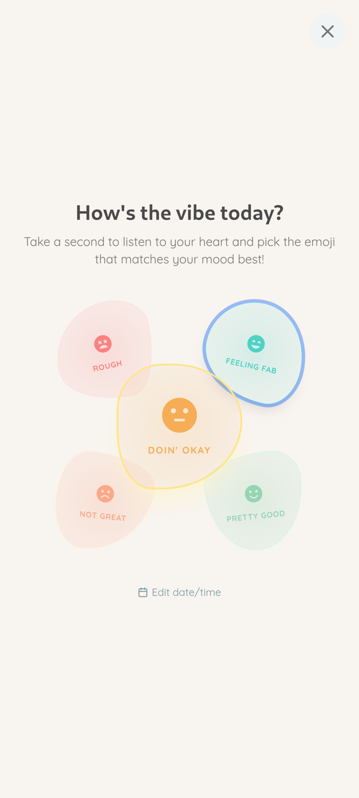
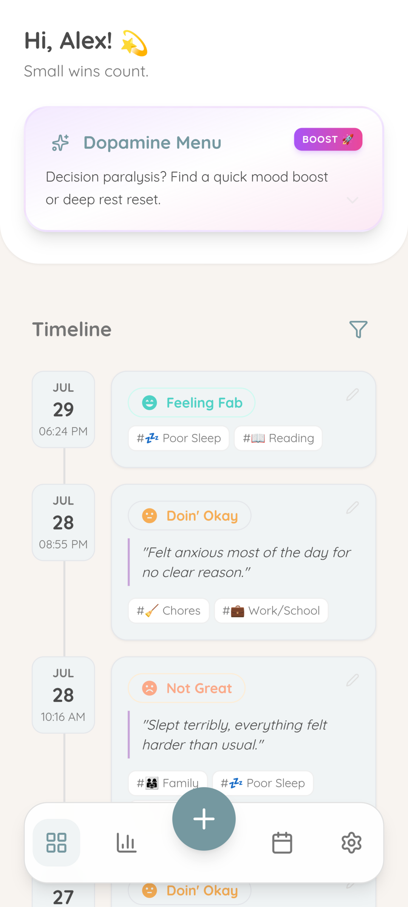
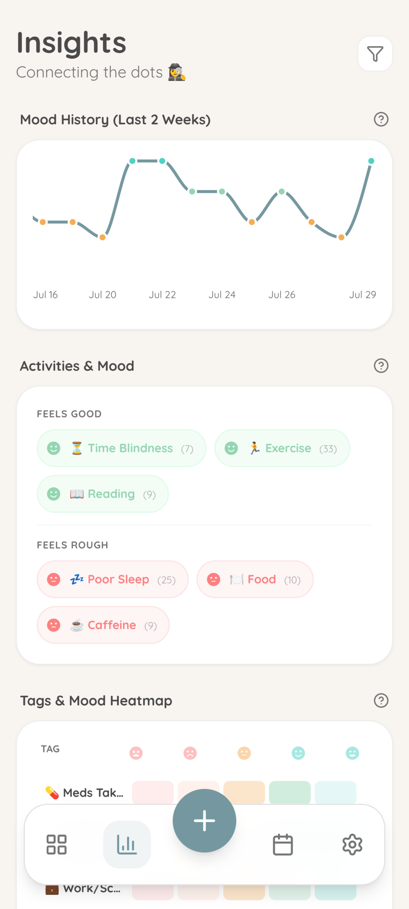
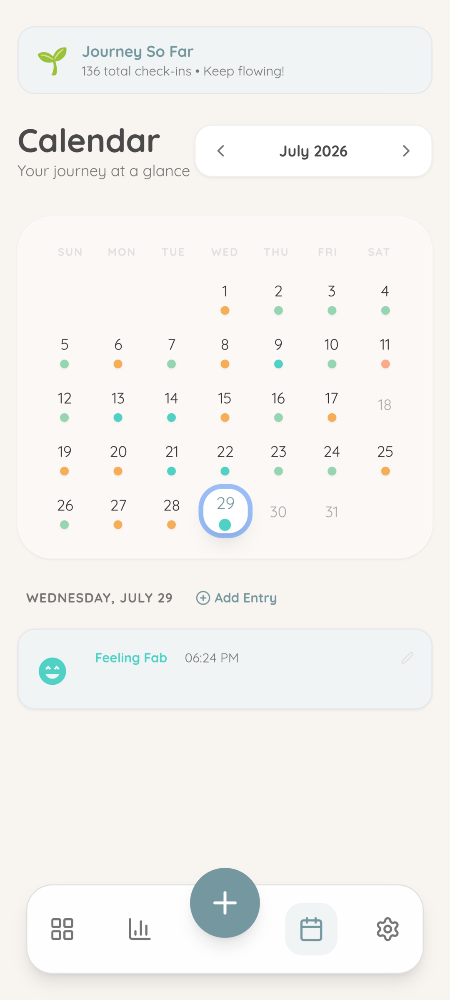
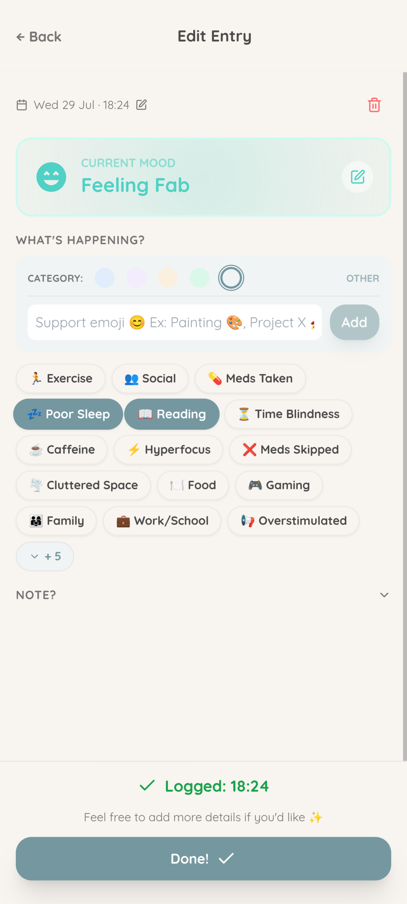
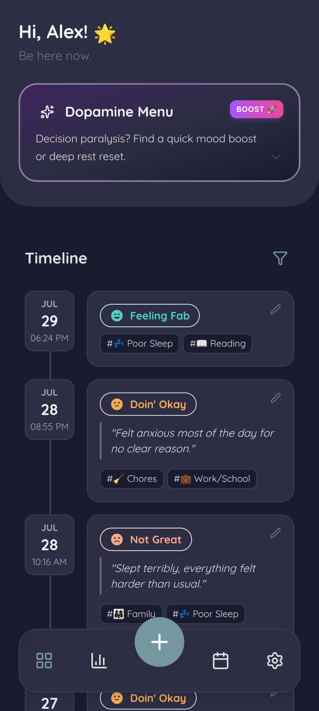
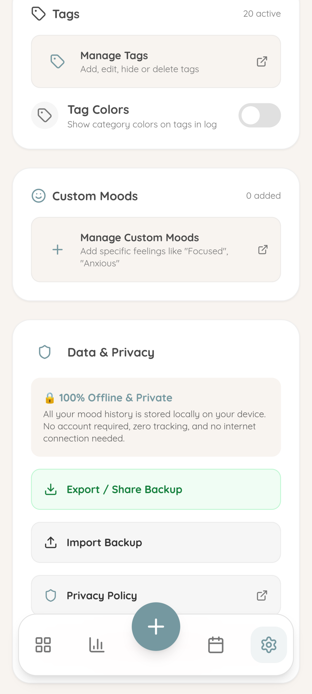

# Vibecheck: Private Mood Tracker

Vibecheck is a private, local-first, low-friction mood and symptom tracker designed for complete privacy and ease of use.

[](https://ko-fi.com/O3I6243PUS)

## Screenshots

| Quick Log | Timeline | Insights | Calendar |
|:---:|:---:|:---:|:---:|
|  |  |  |  |

| Edit Entry | Dark Mode | Privacy & Data |
|:---:|:---:|:---:|
|  |  |  |

## Features

- ⚡ **1-Tap Quick Logging**: Log your mood in seconds with minimal friction.
- 📊 **Calendar Heatmap & Insights**: Visualize trends, energy levels, and mood patterns over time.
- 🧘 **Dopamine Menu**: Grounding activities and gentle prompts for executive function and self-regulation.
- 🔒 **100% Offline & Private**: All data remains on your device. No telemetry, no accounts, no ads, no internet required.
- 🔓 **Fully Unlocked & Open Source**: Free of paywalls and subscriptions under the MIT License.

## Tech Stack

- **Framework**: React 19 + TypeScript + Vite
- **Mobile Runtime**: Capacitor 8 (Android)
- **Styling**: Tailwind CSS / Vanilla CSS
- **Icons**: Lucide React

## Development & Building

### Prerequisites
- Node.js 18+ & npm
- Android SDK & JDK 17+ (for Android APK builds)

### Web Dev Server
```bash
npm install
npm run dev
```

### Typecheck & Test
```bash
npm run typecheck
npm test
```

### Building Android APK (F-Droid)
```bash
npm run build
npx cap sync android
cd android
./gradlew assembleRelease
```
The output APK will be generated at `android/app/build/outputs/apk/release/app-release-unsigned.apk`.

## License

This project is licensed under the [MIT License](LICENSE).
